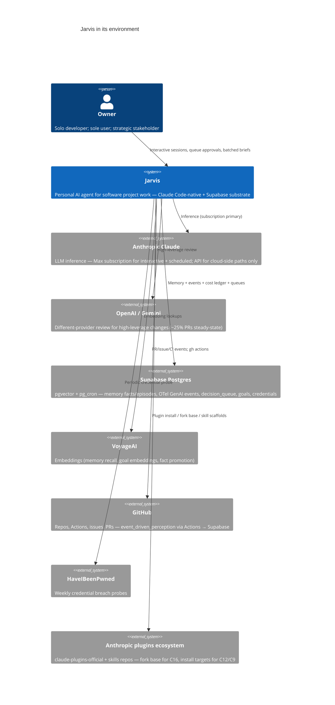
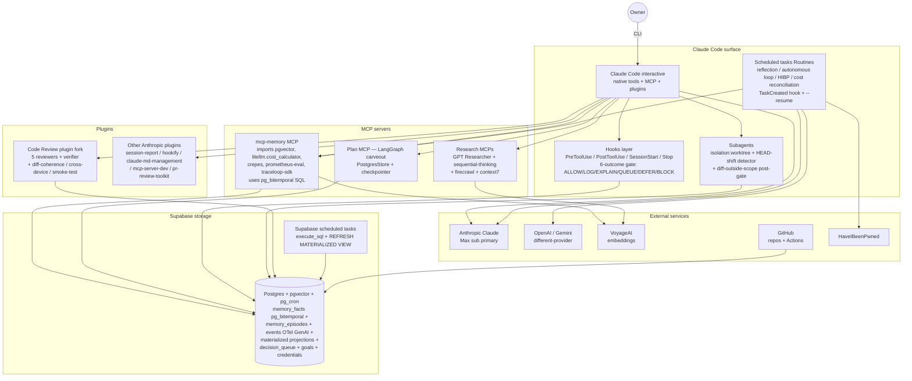
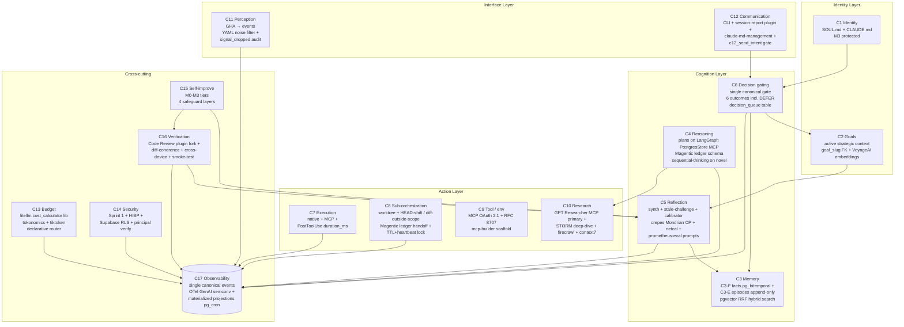
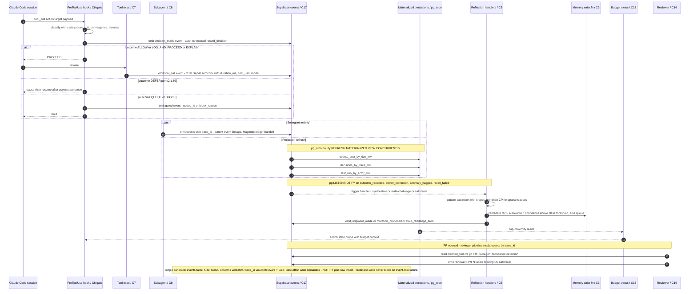

# Jarvis Architecture — C4 Views (revised 2026-04-28)

Four views: Context (system in environment), Container (runtime + storage), Component (17 capabilities in 5 layers + cross-cutting), Event-substrate dataflow (the load-bearing edge: `everything → C17`). Companion to [`jarvis-v2-redesign.md`](jarvis-v2-redesign.md). Reflects L3 concrete adoptions folded in 2026-04-27/28 — see [`jarvis-build-vs-buy.md`](jarvis-build-vs-buy.md).

Rendered SVGs alongside each block: [c4-1.svg](c4-1.svg) Context · [c4-2.svg](c4-2.svg) Container · [c4-3.svg](c4-3.svg) Component · [c4-4.svg](c4-4.svg) Event dataflow. Re-render: `npx -p @mermaid-js/mermaid-cli mmdc -i jarvis-architecture-c4.md -o c4.svg` (writes `c4-1.svg`…`c4-4.svg`).

## C4 Level 1 — Context

## C4 Level 2 — Container

## C4 Level 3 — Component

## C4 Level 4 — Event-substrate dataflow

The single load-bearing edge of the architecture: every cap reads from / writes to C17 events. This view shows ordering, projection refresh, and the reflection mutation arm.

## Reading guide

- **Identity layer** is owner-authored axioms — the alignment substrate. Never auto-mutated (M3). Drift detection delegated to `claude-md-management` plugin (C12).
- **Cognition layer** is what Jarvis *thinks with*. C3 is the durable substrate (bi-temporal facts + episodic events); C4 sequences work on a LangGraph-backed plan store; C5 is the active loop that mutates C3 from C17 events with class-conditional calibration; C6 is the act/ask classifier consulted before every tool call.
- **Action layer** is what Jarvis *does*. C7/C8/C9 are the runtime; C10 is the external info-gathering arm with GPT Researcher as primary engine.
- **Interface layer** is the boundary with the owner — C11 ingests with a YAML noise filter; C12 communicates out via CLI + Anthropic plugins.
- **Cross-cutting** layer wraps everything: C17 is the substrate every event passes through; C13/C14/C16/C15 are governance/safety/quality/evolution functions that consume and gate.

The single most load-bearing edge is **everything → C17** (visualized in Level 4): substrate-as-source-of-truth means audit, reflection, calibration, cost, and review all share the same data. Materialized projections per hot read path (per Q1 reframe — Honeycomb / Greptime "Observability 2.0" guidance) prevent read-amplification on long streams.

## What changed vs prior C4 (2026-04-27)

- **Level 1**: added Anthropic plugins ecosystem as an external system (fork-source + install-target).
- **Level 2**: switched from `C4Container` DSL to `flowchart TB` with subgraph zoning (cleaner auto-layout, less arrow overlap). Split MCP layer into 3 distinct MCPs (memory, plan/LangGraph carveout, research bundle) + plugin layer (forked code-review + installed plugins). pg now explicitly shows pg_bitemporal column shape, OTel GenAI semconv columns, materialized projections, decision_queue.
- **Level 3**: switched from `C4Component` DSL to `flowchart TB` with layer subgraphs. Every component description now carries the concrete L3 adoption (lib name / SQL file / plugin URL) instead of generic "current pattern" language. C6 gate enum expanded to 6 outcomes; C8 worktree gates explicit; C15 stacks 4 safeguard layers; C16 fork-base named; C17 names projection set.
- **Level 4 (new)**: event-substrate dataflow sequence — visualizes the load-bearing edge, including DEFER outcome, parallel projection refresh, LISTEN/NOTIFY trigger to C5, and best-effort write semantics from C3-Q2.
