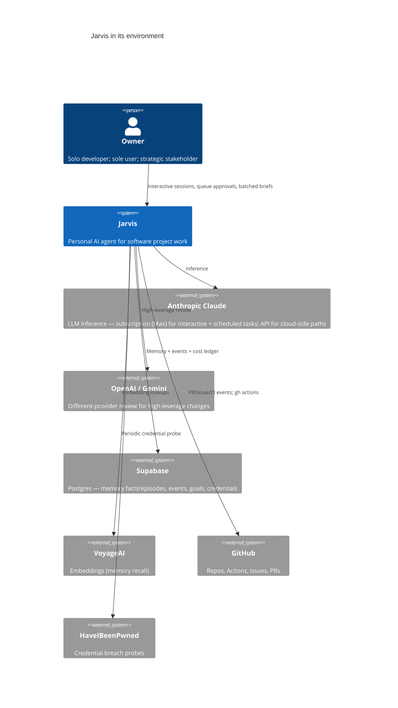
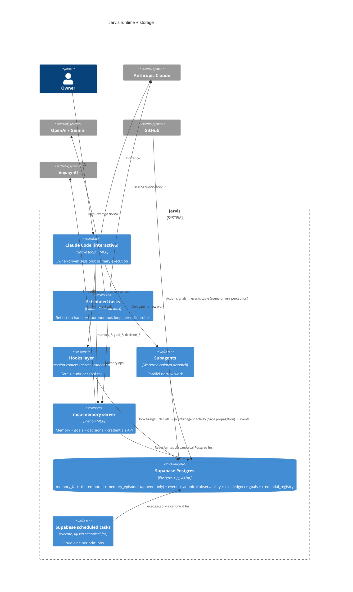
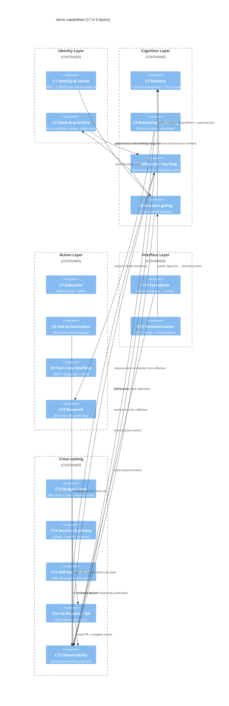

# Jarvis Architecture — C4 Views

Three views: Context (system in its environment), Container (runtime + storage), Component (capabilities). Companion to [jarvis-v2-redesign.md](jarvis-v2-redesign.md).

Rendered SVGs alongside each block: [c4-1.svg](c4-1.svg) Context · [c4-2.svg](c4-2.svg) Container · [c4-3.svg](c4-3.svg) Component. Re-render: `npx -p @mermaid-js/mermaid-cli mmdc -i jarvis-architecture-c4.md -o c4.svg` (writes `c4-1.svg`, `c4-2.svg`, `c4-3.svg`).

## C4 Level 1 — Context

## C4 Level 2 — Container

## C4 Level 3 — Component

## Reading guide

- **Identity layer** is owner-authored axioms — the alignment substrate. Never auto-mutated (M3).
- **Cognition layer** is what Jarvis *thinks with*. C3 is the durable substrate; C4 sequences work; C5 is the active loop that mutates C3 from C17 events; C6 is the act/ask classifier consulted before every tool call.
- **Action layer** is what Jarvis *does*. C7/C8/C9 are the runtime; C10 is the external info-gathering arm.
- **Interface layer** is the boundary with the owner — C11 ingests, C12 communicates out.
- **Cross-cutting** layer wraps everything: C17 is the substrate every event passes through; C13/C14/C16/C15 are governance/safety/quality/evolution functions that consume and gate.

The single most load-bearing edge is **everything → C17**: substrate-as-source-of-truth means audit, reflection, calibration, cost, and review all share the same data.
