# Jarvis Flows — userflow + dataflow

Companion to [`jarvis-v2-redesign.md`](jarvis-v2-redesign.md) and [`jarvis-architecture-c4.md`](jarvis-architecture-c4.md). The C4 set shows **structure** (what exists, where it lives); this file shows **behaviour** (what happens, in what order). Each flow corresponds to a section in the design doc — diagram first, then short notes on what's load-bearing.

Re-render: `npx -p @mermaid-js/mermaid-cli mmdc -i jarvis-flows.md -o flow.svg` (writes `flow-1.svg`…`flow-8.svg`).

## Index

1. [Principal session userflow](#1--principal-session-userflow) — how a session starts, runs, and ends from principal's POV.
2. [Memory I/O — write + recall](#2--memory-io--write--recall) — the C3 canonical funnel.
3. [C6 decision gate](#3--c6-decision-gate) — pre-action act/ask classifier with 6 outcomes.
4. [C8 sub-orchestration dispatch](#4--c8-sub-orchestration-dispatch) — pre/post-dispatch gates around subagent worktree work.
5. [C5 reflection triggers and handlers](#5--c5-reflection-triggers-and-handlers) — event-driven mutation arm.
6. [C15 self-modification cycle](#6--c15-self-modification-cycle) — M0–M3 propose → safeguards → apply → measure.
7. [C16 PR review pipeline](#7--c16-pr-review-pipeline) — reviewer triggers, aggregation, principal surface.
8. [C13 cost cap enforcement](#8--c13-cost-cap-enforcement) — event ledger → projection → soft/hard cap → gate.

---

## 1 — Principal session userflow

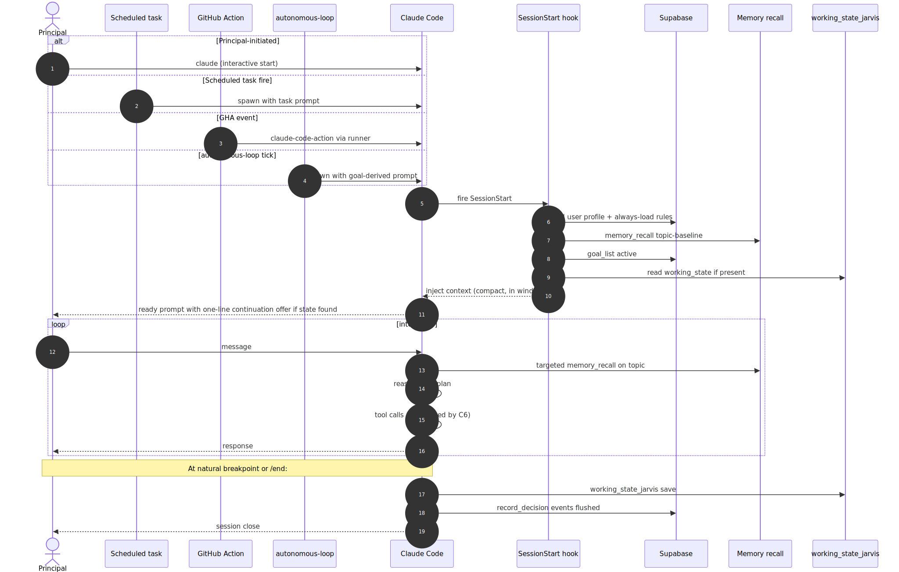

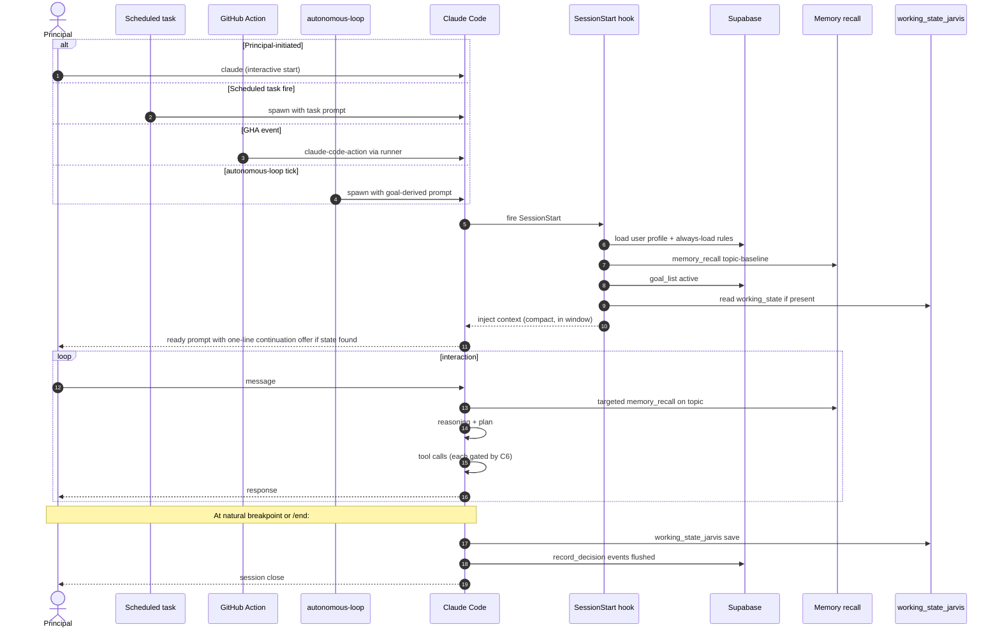
```mermaid
sequenceDiagram
    autonumber
    actor Principal
    participant Sched as Scheduled task
    participant GHA as GitHub Action
    participant ALoop as autonomous-loop
    participant CC as Claude Code
    participant Hook as SessionStart hook
    participant Pg as Supabase
    participant Mem as Memory recall
    participant State as working_state_jarvis

    alt Principal-initiated
        Principal->>CC: claude (interactive start)
    else Scheduled task fire
        Sched->>CC: spawn with task prompt
    else GHA event
        GHA->>CC: claude-code-action via runner
    else autonomous-loop tick
        ALoop->>CC: spawn with goal-derived prompt
    end

    CC->>Hook: fire SessionStart
    Hook->>Pg: load user profile + always-load rules
    Hook->>Mem: memory_recall topic-baseline
    Hook->>Pg: goal_list active
    Hook->>State: read working_state if present
    Hook-->>CC: inject context (compact, in window)
    CC-->>Principal: ready prompt with one-line continuation offer if state found

    loop interaction
        Principal->>CC: message
        CC->>Mem: targeted memory_recall on topic
        CC->>CC: reasoning + plan
        CC->>CC: tool calls (each gated by C6)
        CC-->>Principal: response
    end

    Note over Principal, CC: At natural breakpoint or /end:
    CC->>State: working_state_jarvis save
    CC->>Pg: record_decision events flushed
    CC-->>Principal: session close
```

**Key points.** **Same bootstrap fires regardless of session origin** — principal-interactive, scheduled tasks, GHA-triggered, autonomous-loop tick all converge on the SessionStart hook. For autonomous origins, the interaction loop processes goal-derived queued prompts in place of principal messages; rest of the flow unchanged. Bootstrap context arrives via hook in one shot (no MCP calls during session start — already in window per CLAUDE.md). Targeted recall happens during interaction, not at session start. Working state is saved at natural breakpoints, not every tool call. After context compression, recall surfaces "working state" first.

---

## 2 — Memory I/O — write + recall

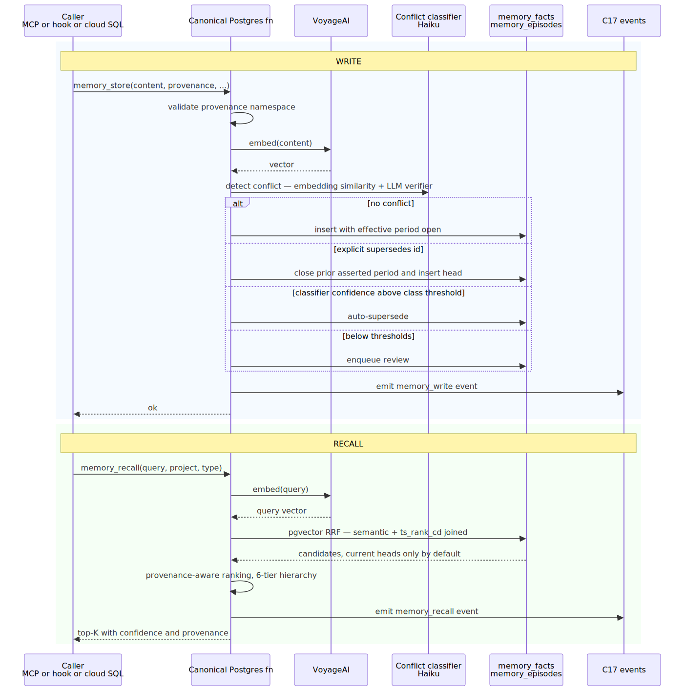

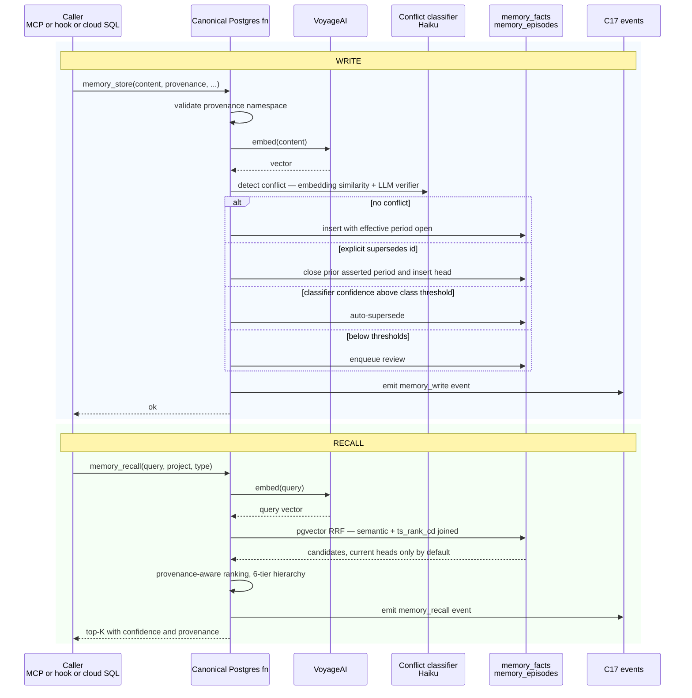
```mermaid
sequenceDiagram
    participant Caller as Caller<br/>MCP or hook or cloud SQL
    participant API as Canonical Postgres fn
    participant Voyage as VoyageAI
    participant Class as Conflict classifier<br/>Haiku
    participant Pg as memory_facts<br/>memory_episodes
    participant Events as C17 events

    rect rgb(245, 250, 255)
    Note over Caller, Events: WRITE
    Caller->>API: memory_store(content, provenance, ...)
    API->>API: validate provenance namespace
    API->>Voyage: embed(content)
    Voyage-->>API: vector
    API->>Class: detect conflict — embedding similarity + LLM verifier
    alt no conflict
        API->>Pg: insert with effective period open
    else explicit supersedes id
        API->>Pg: close prior asserted period and insert head
    else classifier confidence above class threshold
        API->>Pg: auto-supersede
    else below thresholds
        API->>Pg: enqueue review
    end
    API->>Events: emit memory_write event
    API-->>Caller: ok
    end

    rect rgb(245, 255, 245)
    Note over Caller, Events: RECALL
    Caller->>API: memory_recall(query, project, type)
    API->>Voyage: embed(query)
    Voyage-->>API: query vector
    API->>Pg: pgvector RRF — semantic + ts_rank_cd joined
    Pg-->>API: candidates, current heads only by default
    API->>API: provenance-aware ranking, 6-tier hierarchy
    API->>Events: emit memory_recall event
    API-->>Caller: top-K with confidence and provenance
    end
```

**Key points.** **One canonical Postgres function** for both directions — every caller (MCP, hook, cloud SQL) goes through the same path, no degraded paths. **Provenance is mandatory** at write time and used for ranking at recall. **Bi-temporal periods** (`effective`, `asserted`) replace `superseded_by` — supersession is closing the prior period. **Three lanes** at write: explicit / classifier / queue. Event emission is best-effort — recall and write never block on event-row failure.

---

## 3 — C6 decision gate



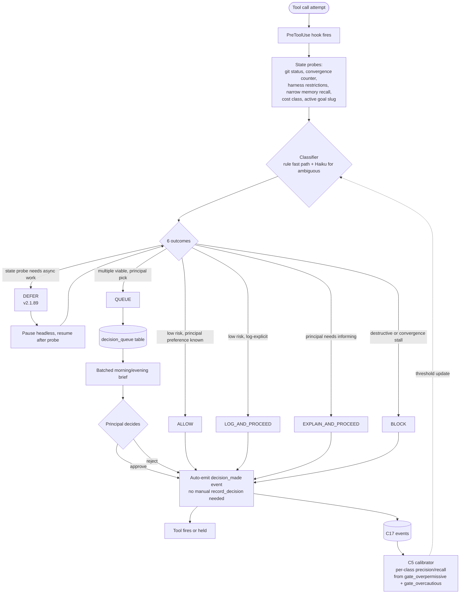
```mermaid
flowchart TB
    start([Tool call attempt]) --> hook[PreToolUse hook fires]
    hook --> probes[State probes:<br/>git status, convergence counter,<br/>harness restrictions, narrow memory recall,<br/>cost class, active goal slug]
    probes --> classify{Classifier<br/>rule fast path + Haiku for ambiguous}
    classify --> outcome{6 outcomes}

    outcome -->|low risk, principal preference known| allow[ALLOW]
    outcome -->|low risk, log-explicit| log[LOG_AND_PROCEED]
    outcome -->|principal needs informing| explain[EXPLAIN_AND_PROCEED]
    outcome -->|state probe needs async work| defer[DEFER<br/>v2.1.89]
    outcome -->|multiple viable, principal pick| queue[QUEUE]
    outcome -->|destructive or convergence stall| block[BLOCK]

    defer --> resume[Pause headless, resume after probe] --> outcome
    queue --> qtbl[(decision_queue table)]
    qtbl --> brief[Batched morning/evening brief]
    brief --> principald{Principal decides}
    principald -->|approve| emit
    principald -->|reject| emit

    allow --> emit
    log --> emit
    explain --> emit
    block --> emit

    emit[Auto-emit decision_made event<br/>no manual record_decision needed]
    emit --> action[Tool fires or held]
    emit --> events[(C17 events)]
    events --> calib[C5 calibrator<br/>per-class precision/recall<br/>from gate_overpermissive + gate_overcautious]
    calib -.->|threshold update| classify
```

**Key points.** **Single canonical gate** consulted for every tool call across all lanes (interactive / scheduled / subagent). **State-aware** — `topic_hash` convergence counter catches 3-attempt stalls deterministically. `decision_queue` is a **separate table** (workflow with state), not the C17 events table (append-only). `record_decision` is auto-emitted by the gate — no manual call required, closes compliance gap. **DEFER** outcome added per Claude Code v2.1.89 PreToolUse `defer` decision. **Learning loop closed** — `gate_overpermissive` (principal reverts) and `gate_overcautious` (principal approves queued with annotation) feed C5 calibrator; per-class threshold auto-adjusts (redesign §C6 calibration).

---

## 4 — C8 sub-orchestration dispatch

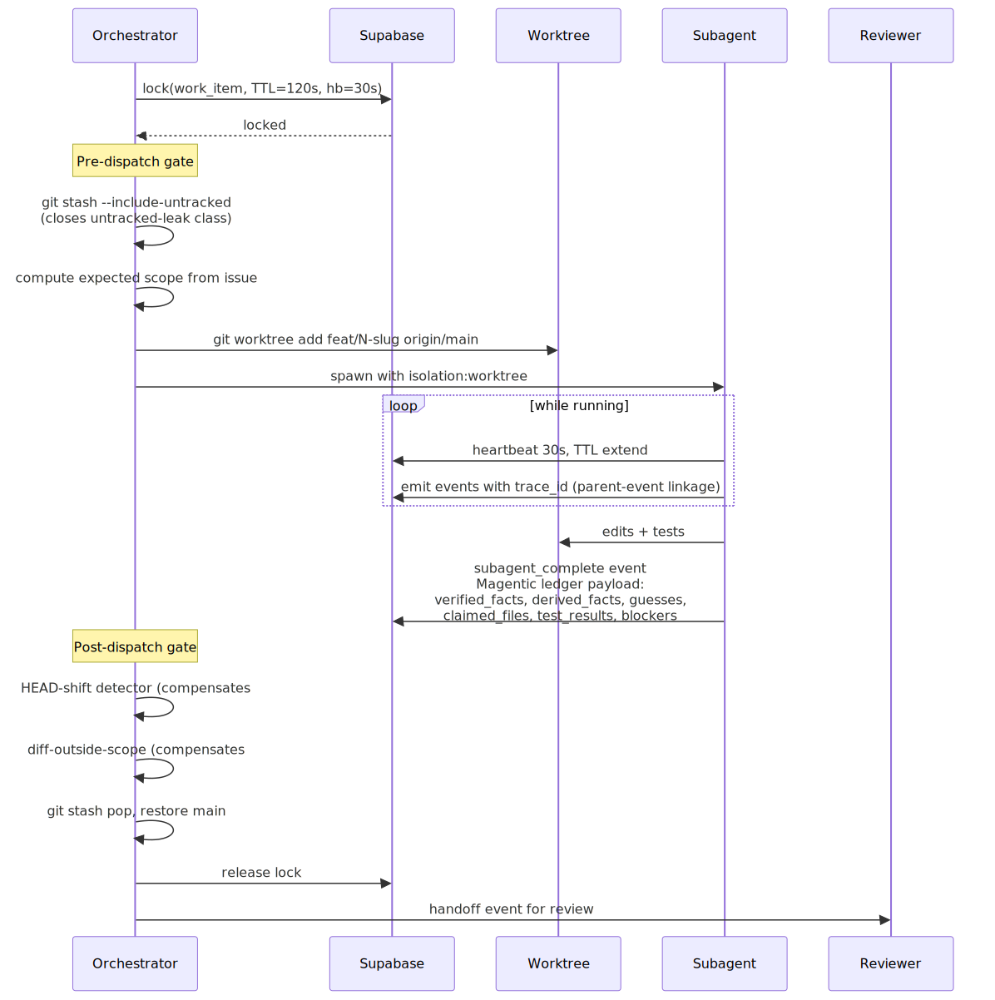

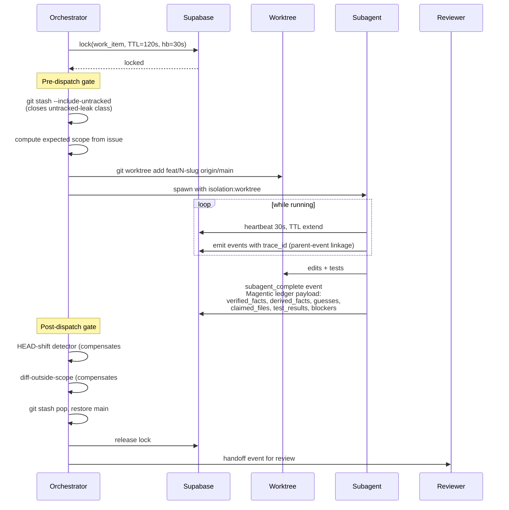
```mermaid
sequenceDiagram
    participant Orch as Orchestrator
    participant Pg as Supabase
    participant Wt as Worktree
    participant SA as Subagent
    participant C16 as Reviewer

    Orch->>Pg: lock(work_item, TTL=120s, hb=30s)
    Pg-->>Orch: locked

    Note over Orch: Pre-dispatch gate
    Orch->>Orch: git stash --include-untracked<br/>(closes untracked-leak class)
    Orch->>Orch: compute expected scope from issue
    Orch->>Wt: git worktree add feat/N-slug origin/main
    Orch->>SA: spawn with isolation:worktree

    loop while running
        SA->>Pg: heartbeat 30s, TTL extend
        SA->>Pg: emit events with trace_id (parent-event linkage)
    end

    SA->>Wt: edits + tests
    SA->>Pg: subagent_complete event<br/>Magentic ledger payload:<br/>verified_facts, derived_facts, guesses,<br/>claimed_files, test_results, blockers

    Note over Orch: Post-dispatch gate
    Orch->>Orch: HEAD-shift detector (compensates #50850)
    Orch->>Orch: diff-outside-scope (compensates #39886)
    Orch->>Orch: git stash pop, restore main
    Orch->>Pg: release lock
    Orch->>C16: handoff event for review
```

**Key points.** **Orchestrator-side gates compensate open Claude Code worktree bugs** (#39886 silent fall-through, #50850 HEAD-shift) — even after harness fixes, gates remain (defense in depth). **`git stash --include-untracked` pre-dispatch** is the structural fix to the untracked-file-leak class. **Magentic-One ledger** as handoff payload shape (verified-facts / derived-facts / guesses + claimed_files / test_results / blockers). Heartbeat 30s, TTL 120s — survives one missed beat.

---

## 5 — C5 reflection triggers and handlers



```mermaid
flowchart TB
    subgraph TRIG[Triggers]
        direction TB
        ev_outcome[outcome_recorded]
        ev_correct[principal_correction]
        ev_anomaly[anomaly_flagged spike]
        ev_decision[N decisions accumulated]
        ev_recall_fail[recall_failed FoK]
        sweep[Weekly + quarterly sweeps<br/>backstop for cold-tail memories]
        invoke[/reflect command/]
    end

    disp[Dispatcher<br/>pg LISTEN/NOTIFY]

    subgraph HAND[Handlers — independent, calibrated]
        synth[Synthesizer<br/>events to patterns to candidate facts]
        stale[Stale-challenger<br/>topic match + LLM judge]
        calib[Calibrator<br/>Brier per judge<br/>crepes Mondrian CP]
        fok[FoK<br/>known-unknown logging]
        anom[Anomaly investigator<br/>policy re-examination]
    end

    subgraph APPLY[3-lane apply mirrors C3]
        lane1[Confidence above class threshold<br/>AND judge precision validated<br/>auto-write to C3]
        lane2[Below thresholds<br/>review queue]
        lane3[Principal correction<br/>ground-truth label<br/>feeds calibrator]
    end

    ev_outcome --> disp
    ev_correct --> disp
    ev_anomaly --> disp
    ev_decision --> disp
    ev_recall_fail --> disp
    sweep --> disp
    invoke --> disp

    disp --> synth
    disp --> stale
    disp --> calib
    disp --> fok
    disp --> anom

    synth --> APPLY
    stale --> APPLY
    calib -.-> APPLY

    APPLY --> c3[(C3 Memory)]
    lane3 --> calib

    synth --> goalcand[Candidate child goal<br/>from principal_message + decision_made]
    goalcand --> c2draft[C2 draft goal<br/>provenance:agent_extracted<br/>confidence:low<br/>status:draft]
    c2draft --> brief[/status + batched brief<br/>accept / edit / dismiss]
    c2draft -.->|7-day quiet auto-dismiss| dismiss[draft_auto_dismissed log]
    brief -->|accept| c2[(C2 Goals)]

    c3 --> events[(C17 events:<br/>judgment_made, mutation_proposed,<br/>stale_challenge_fired)]
```

**Key points.** **Event-triggered primary, sweeps as backstop** — no pure cron. Per `Memory-driven autonomy` op policy. **Each handler narrow + independently calibratable** — synthesizer, stale-challenger, calibrator, FoK, anomaly investigator. **Cold-start: `crepes` Mondrian CP** does class-conditional calibration — partial-pooling across semantically-near classes when leaf class has no labels. Stale-challenger sweep deferred until first month of labels accumulates. **Goals as candidate output** — synthesizer produces candidate child goals from `principal_message` + `decision_made` events; per Phase C redesign §C2, candidates **auto-create as drafts** (no C6 queue; rate-limited 3/week; 7-day quiet auto-dismiss). Principal accepts/edits/dismisses in `/status` or batched brief.

---

## 6 — C15 self-modification cycle

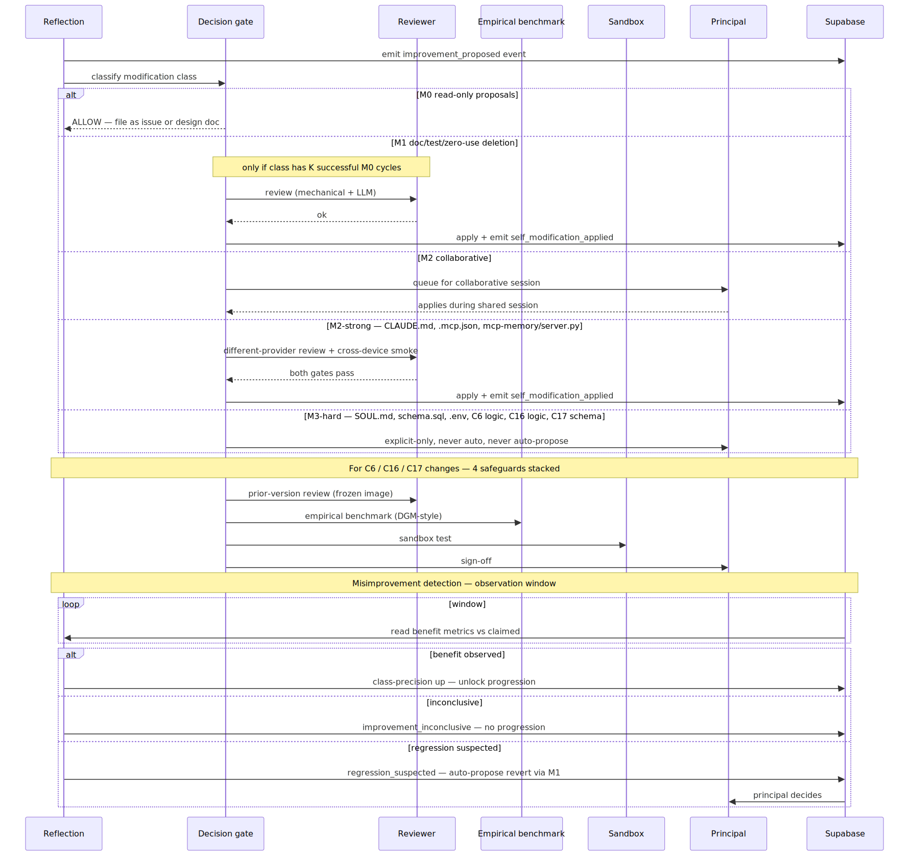

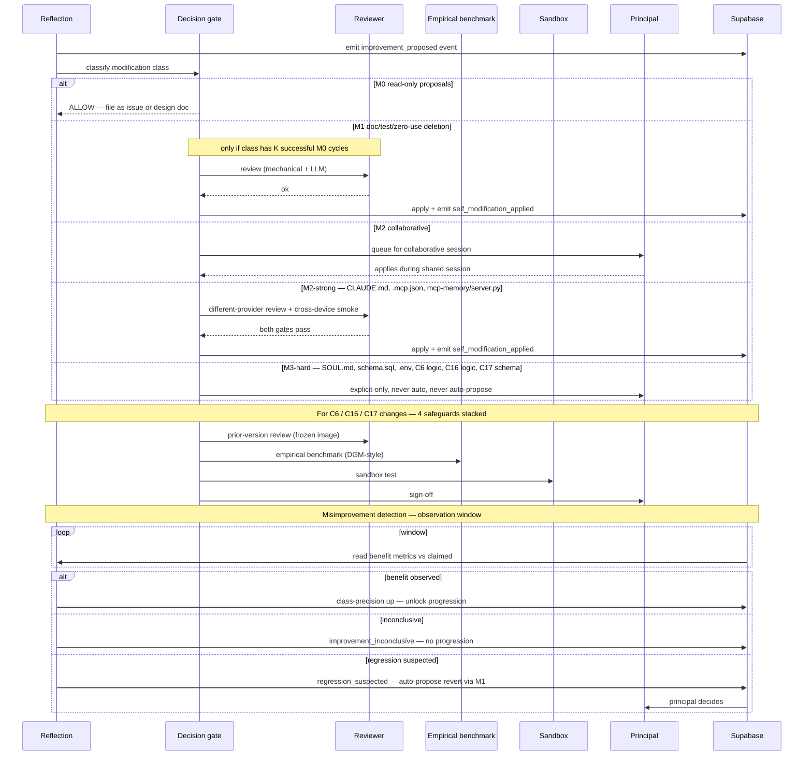
```mermaid
sequenceDiagram
    participant C5 as Reflection
    participant C6 as Decision gate
    participant C16 as Reviewer
    participant Bench as Empirical benchmark
    participant Sandbox
    participant Principal
    participant Pg as Supabase

    C5->>Pg: emit improvement_proposed event
    C5->>C6: classify modification class

    alt M0 read-only proposals
        C6-->>C5: ALLOW — file as issue or design doc
    else M1 doc/test/zero-use deletion
        Note over C6, C16: only if class has K successful M0 cycles
        C6->>C16: review (mechanical + LLM)
        C16-->>C6: ok
        C6->>Pg: apply + emit self_modification_applied
    else M2 collaborative
        C6->>Principal: queue for collaborative session
        Principal-->>C6: applies during shared session
    else M2-strong — CLAUDE.md, .mcp.json, mcp-memory/server.py
        C6->>C16: different-provider review + cross-device smoke
        C16-->>C6: both gates pass
        C6->>Pg: apply + emit self_modification_applied
    else M3-hard — SOUL.md, schema.sql, .env, C6 logic, C16 logic, C17 schema
        C6->>Principal: explicit-only, never auto, never auto-propose
    end

    Note over C5, Pg: For C6 / C16 / C17 changes — 4 safeguards stacked
    C6->>C16: prior-version review (frozen image)
    C6->>Bench: empirical benchmark (DGM-style)
    C6->>Sandbox: sandbox test
    C6->>Principal: sign-off

    Note over C5, Pg: Misimprovement detection — observation window
    loop window
        Pg->>C5: read benefit metrics vs claimed
    end
    alt benefit observed
        C5->>Pg: class-precision up — unlock progression
    else inconclusive
        C5->>Pg: improvement_inconclusive — no progression
    else regression suspected
        C5->>Pg: regression_suspected — auto-propose revert via M1
        Pg->>Principal: principal decides
    end
```

**Key points.** **Per-class trust ladder** — M0 → M1 unlocks per class only after K successful cycles. **M3-hard never unlocks autonomously** (Phase C 6-item fixed list: SOUL.md, schema.sql, .env, C6 logic, C16 logic, C17 schema). **M2-strong** (CLAUDE.md, .mcp.json, mcp-memory/server.py) — autonomous OK with different-provider review + cross-device smoke per Phase C M3 split. **4 safeguards stacked for C6/C16/C17 changes** — prior-version review + empirical benchmark (per DGM) + sandbox + principal sign-off. Per-class precision unlocks/locks via `improvement_inconclusive` / `regression_suspected` events. **Compaction-aware**: state lives in artifacts (PR, issue, events), not session memory.

---

## 7 — C16 PR review pipeline



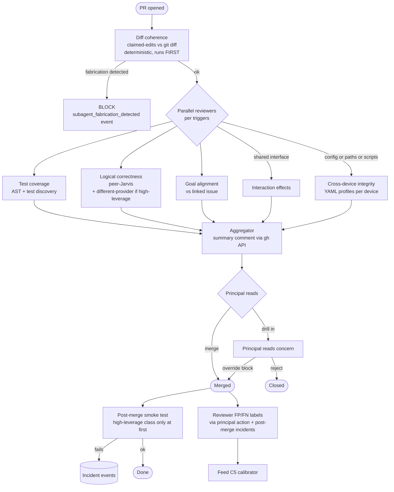
```mermaid
flowchart TB
    pr_open([PR opened]) --> first[Diff coherence<br/>claimed-edits vs git diff<br/>deterministic, runs FIRST]

    first -->|fabrication detected| block_fab[BLOCK<br/>subagent_fabrication_detected event]
    first -->|ok| parallel{Parallel reviewers<br/>per triggers}

    parallel --> test_cov[Test coverage<br/>AST + test discovery]
    parallel --> logical[Logical correctness<br/>peer-Jarvis<br/>+ different-provider if high-leverage]
    parallel --> goal_align[Goal alignment<br/>vs linked issue]
    parallel -->|shared interface| inter[Interaction effects]
    parallel -->|config or paths or scripts| xdev[Cross-device integrity<br/>YAML profiles per device]

    test_cov --> agg
    logical --> agg
    goal_align --> agg
    inter --> agg
    xdev --> agg

    agg[Aggregator<br/>summary comment via gh API]
    agg --> principal_view{Principal reads}
    principal_view -->|merge| merged([Merged])
    principal_view -->|drill in| dr[Principal reads concern]
    dr -->|override block| merged
    dr -->|reject| closed([Closed])

    merged --> smoke[Post-merge smoke test<br/>high-leverage class only at first]
    smoke -->|fails| incident[(Incident events)]
    smoke -->|ok| done([Done])

    merged --> labels[Reviewer FP/FN labels<br/>via principal action + post-merge incidents]
    labels --> calib[Feed C5 calibrator]
```

**Key points.** **Diff coherence runs FIRST and gates everything else** — claimed-edits vs `git diff` mismatch → `subagent_fabrication_detected` BLOCK, no further review attempted. Cheap to implement, high-leverage. **Mechanical reviewers (deterministic)** alongside LLM ones — diff coherence + test coverage are facts, not judgment. **Different-provider mandatory** for high-leverage class (schema / cross-project / C6/C16/C17 / security / API contract). **Principal sees aggregator summary**, never individual reviewer outputs by default. FP/FN labels feed C5 — over-permissive vs over-cautious tracked symmetrically.

---

## 8 — C13 cost cap enforcement

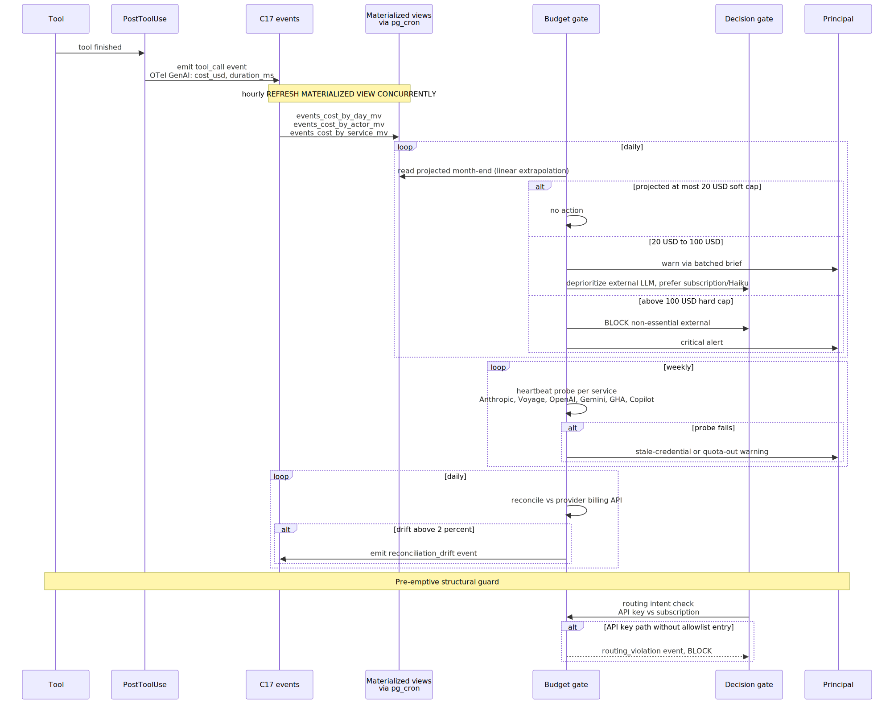

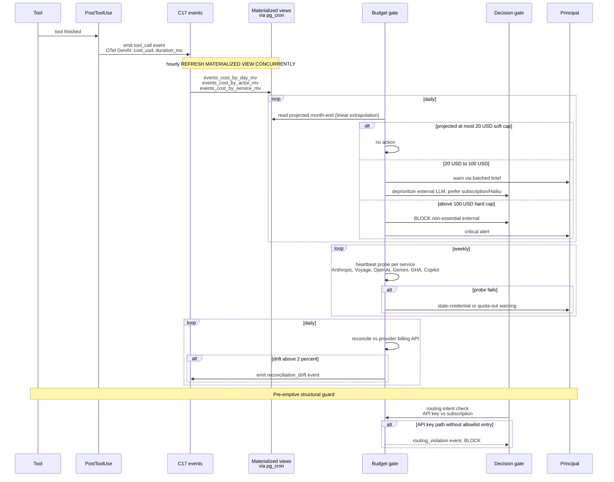
```mermaid
sequenceDiagram
    participant Tool
    participant PostHook as PostToolUse
    participant Events as C17 events
    participant Views as Materialized views<br/>via pg_cron
    participant C13 as Budget gate
    participant C6 as Decision gate
    participant Principal

    Tool->>PostHook: tool finished
    PostHook->>Events: emit tool_call event<br/>OTel GenAI: cost_usd, duration_ms

    Note over Events, Views: hourly REFRESH MATERIALIZED VIEW CONCURRENTLY
    Events->>Views: events_cost_by_day_mv<br/>events_cost_by_actor_mv<br/>events_cost_by_service_mv

    loop daily
        C13->>Views: read projected month-end (linear extrapolation)
        alt projected at most 20 USD soft cap
            C13->>C13: no action
        else 20 USD to 100 USD
            C13->>Principal: warn via batched brief
            C13->>C6: deprioritize external LLM, prefer subscription/Haiku
        else above 100 USD hard cap
            C13->>C6: BLOCK non-essential external
            C13->>Principal: critical alert
        end
    end

    loop weekly
        C13->>C13: heartbeat probe per service<br/>Anthropic, Voyage, OpenAI, Gemini, GHA, Copilot
        alt probe fails
            C13->>Principal: stale-credential or quota-out warning
        end
    end

    loop daily
        C13->>C13: reconcile vs provider billing API
        alt drift above 2 percent
            C13->>Events: emit reconciliation_drift event
        end
    end

    Note over Tool, Principal: Pre-emptive structural guard
    C6->>C13: routing intent check<br/>API key vs subscription
    alt API key path without allowlist entry
        C13-->>C6: routing_violation event, BLOCK
    end
```

**Key points.** **Cost-on-event** (inline `cost_usd` in C17 event row) — no separate ledger table. Aggregations are SQL views, refreshed hourly via `pg_cron`. **Two-threshold gate** — soft $20 (warn), hard $100 (block). **API-key-vs-subscription routing protection** — closes the $1800-bill class. **Heartbeat probes weekly per service** — credential exhaustion caught before the next 400. **Daily reconciliation vs provider billing API** — drift > 2% emits investigation event.
